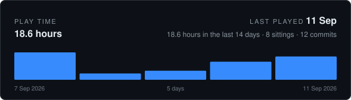

<!-- CODING-TIME:START -->

How this is counted

Commits record when work was saved, never how long it took, so this is an
estimate rather than a timesheet. Commits less than 120 minutes apart
count as one sitting and contribute the real time between them; a commit that
opens a sitting contributes a flat 120 minutes for the work that led up to
it. Merges are skipped, and nothing that was never committed is visible here.

Covers every author. Regenerated on each commit by `.githooks/coding-time`,
which reads commit timestamps and nothing else. `GAP_MINUTES`, `OPENING_MINUTES`,
`RECENT_DAYS` and `DAYS` change what it assumes.

<!-- CODING-TIME:END -->

Finite resources. Finite lives. Interaction.

Nothing else has to be assumed. What is finite can be needed by more than one at a
time, and that alone is enough for everything that follows.

Need is what turns an amount into a scarcity. Scarcity is what turns two that need into
two that must answer for each other. Out of that answer comes every arrangement there
has ever been between living things — agreement, refusal, order, violence — each of
them a reply to the same question: who gets what there is not enough of.

No reply ever adds to what there is. It only settles the order of spending, and
spending is how anything stays. What burns brightest is spent soonest, and what lived
by the burning cannot continue once it is gone.

Underneath, this is not one mechanism for what people do and another for what the
universe does. It is the same one, and it does not soften when it stops being about
people.

What it arrives at is not an event. It is what is left when nothing is different enough
from anything else for anything further to happen — no difference, no exchange, no
light. The dark is not an ending imposed on the process. It is the process, finished.

---

